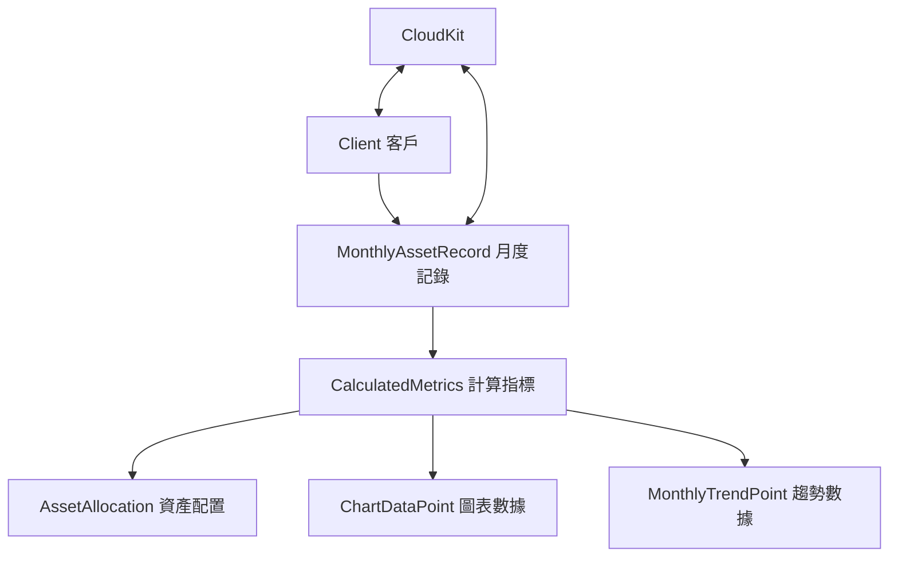

# 📊 數據模型架構指南 (Data Models Guide)

## 🎯 功能概述
投資儀表板的核心數據層，包含客戶管理、月度資產記錄和計算指標三大模型。

## 📁 檔案路徑結構
```
InvestmentDashboard-iOS/Models/
├── Client.swift                 # 客戶模型
├── MonthlyAssetRecord.swift     # 月度資產明細
└── CalculatedMetrics.swift      # 計算指標模型
```

---

## 🔧 核心組件說明

### 1. Client.swift - 客戶模型
**路徑**: `Models/Client.swift`

**主要功能**:
- 管理客戶基本資訊 (姓名、創建日期等)
- CloudKit 同步支援
- 提供範例數據

**關鍵屬性**:
```swift
struct Client {
    let id: String           // 唯一識別碼
    var name: String         // 客戶姓名
    var createdDate: Date    // 創建時間
    var lastUpdated: Date    // 最後更新時間
}
```

**使用範例**:
```swift
// 創建新客戶
let client = Client(name: "張先生")

// CloudKit 轉換
let record = client.toCKRecord()
let clientFromRecord = Client(from: record)
```

---

### 2. MonthlyAssetRecord.swift - 月度資產明細
**路徑**: `Models/MonthlyAssetRecord.swift`

**主要功能**:
- 記錄客戶每月資產詳細資料 (16個欄位)
- 自動計算總資產、損益、報酬率
- CloudKit 數據持久化

**核心資產欄位**:
```swift
struct MonthlyAssetRecord {
    // 基本資訊
    var clientID: String        // 關聯客戶
    var date: Date              // 記錄日期
    
    // 資產項目 (5大類)
    var cash: Double            // 現金
    var usStock: Double         // 美股
    var bonds: Double           // 債券
    var twStock: Double         // 台股
    var structuredProducts: Double // 結構型商品
    
    // 計算屬性
    var totalAssets: Double     // 總資產
    var totalPnL: Double        // 總損益
    var totalPnLPercentage: Double // 報酬率%
}
```

**使用範例**:
```swift
// 創建資產記錄
let record = MonthlyAssetRecord(
    clientID: "client-123",
    cash: 2000000,
    usStock: 4500000,
    bonds: 2500000
)

// 獲取計算結果
print("總資產: \(record.totalAssets)")
print("報酬率: \(record.totalPnLPercentage)%")
```

---

### 3. CalculatedMetrics.swift - 計算指標模型
**路徑**: `Models/CalculatedMetrics.swift`

**主要功能**:
- 從月度資產記錄計算衍生指標
- 生成資產配置百分比
- 產生圖表所需數據

**核心結構**:
```swift
struct CalculatedMetrics {
    let totalAssets: Double           // 總資產
    let totalPnL: Double             // 總損益
    let allocationPercentages: AssetAllocation  // 資產配置%
    let chartData: [ChartDataPoint]  // 圓餅圖數據
    let monthlyTrend: [MonthlyTrendPoint] // 月度趨勢
}

struct AssetAllocation {
    let usStockPercentage: Double    // 美股 %
    let bondsPercentage: Double      // 債券 %
    let cashPercentage: Double       // 現金 %
    let twStockPercentage: Double    // 台股 %
    let structuredPercentage: Double // 結構型 %
}
```

**使用範例**:
```swift
// 從記錄陣列計算指標
let metrics = CalculatedMetrics(from: monthlyRecords)

// 獲取資產配置
let allocation = metrics.allocationPercentages
print("美股占比: \(allocation.usStockPercentage)%")

// 獲取圖表數據
let chartData = metrics.chartData // 用於圓餅圖
```

---

## 🔄 數據流向圖



---

## 🛠 維護指南

### 新增資產類型
**步驟**:
1. 在 `MonthlyAssetRecord.swift` 新增屬性
2. 更新 `toCKRecord()` 和 `init(from record:)` 方法
3. 修改 `AssetAllocation` 計算邏輯
4. 更新 `generateChartData()` 方法

### 修改計算邏輯
**檔案**: `CalculatedMetrics.swift`
**位置**: `init(from records:)` 方法內

### CloudKit 欄位變更
**影響範圍**:
- `Client.swift` 的 `toCKRecord()` 方法
- `MonthlyAssetRecord.swift` 的 CloudKit 轉換方法

---

## ✅ 測試驗證

### 範例數據測試
```swift
// 使用內建範例數據
let sampleClient = Client.sampleClients.first!
let sampleRecord = MonthlyAssetRecord.sampleRecord(for: sampleClient.id)
let metrics = CalculatedMetrics(from: [sampleRecord])

print("範例總資產: \(metrics.totalAssets)")
print("主要配置: \(metrics.allocationPercentages.majorAllocation)")
```

### CloudKit 同步測試
```swift
// 客戶資料同步
let client = Client(name: "測試客戶")
let record = client.toCKRecord()
let restoredClient = Client(from: record)

assert(client.name == restoredClient?.name)
```

---

## 🚀 下一步整合

1. **服務層** - 將在 `Services/CloudKitService.swift` 中使用這些模型
2. **視圖模型** - ViewModels 將操作這些數據模型
3. **UI 組件** - SwiftUI Views 將顯示計算後的指標

---

**更新日期**: 2025-09-08  
**版本**: 1.0  
**負責模組**: 數據層 (Data Layer)